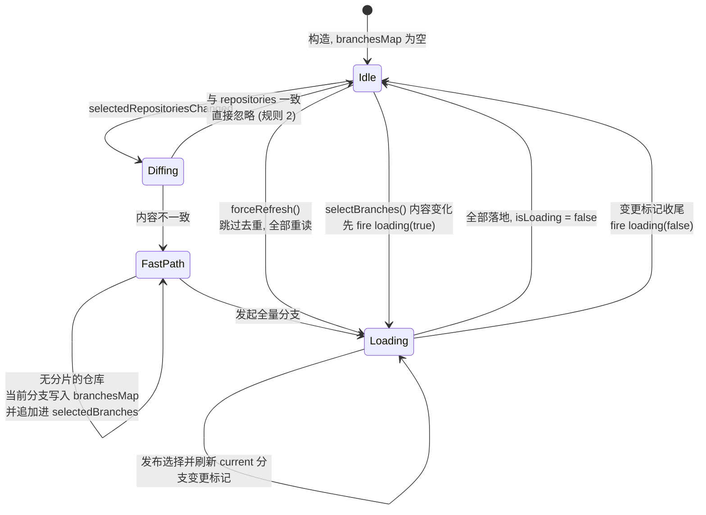
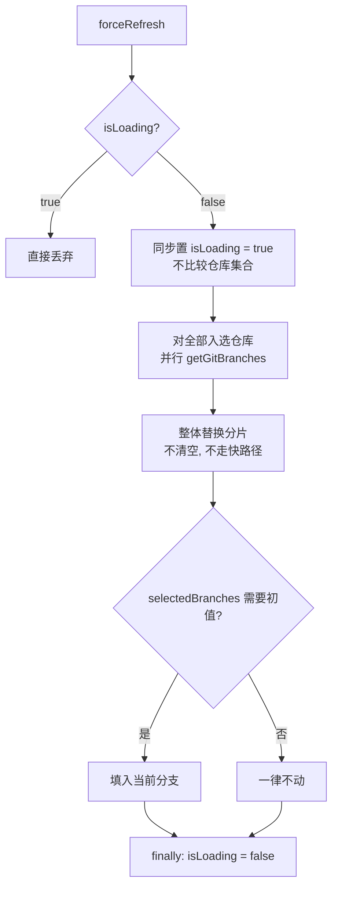
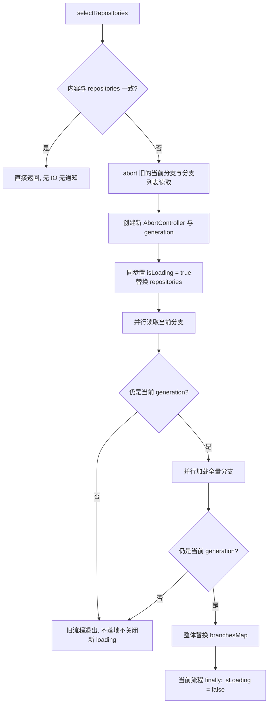
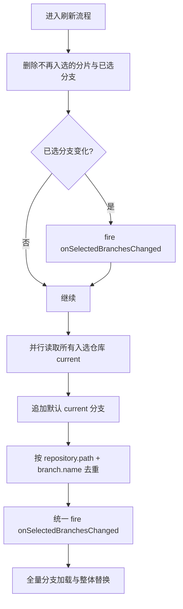
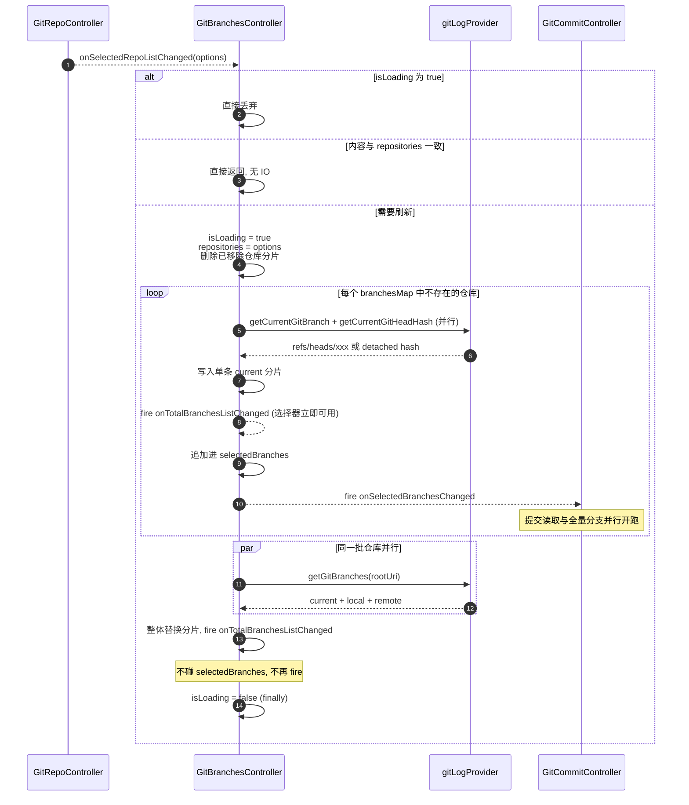
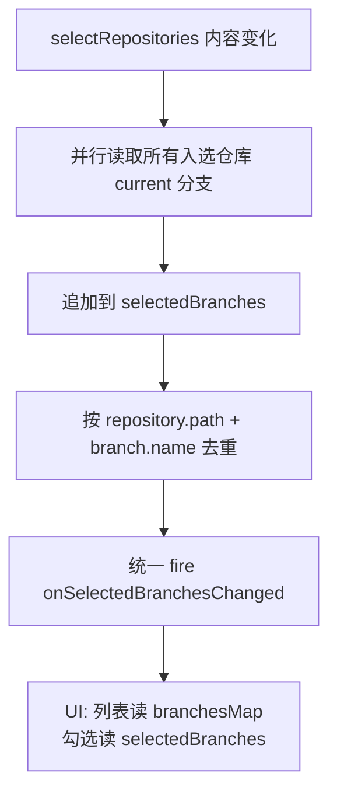

# GitBranchesController 需求

## 0. 目标与边界

`branchesMap` / `selectedBranches` 的**唯一写入者**。

只管分支维度，不涉及仓库发现、提交读取、变更文件，也不直接操作 Webview。依赖链单向：仓库 → 分支，控制器**不得**反向调用 `GitRepoController`。

全部行为只有五条：

1. 内部订阅 `GitRepoController.onSelectedRepoListChanged`；仓库选择处理为 private，外部不得调用。
2. 仓库或分支选择内容与已消费快照不一致才刷新/发布，一致则整个调用返回。
3. 内容不同的仓库选择会取消旧的分支读取并立即启动新流程。
4. 仓库选择时把所有入选仓库的当前分支追加进 `selectedBranches`，按仓库 path + 分支 name 去重，并回调 `onSelectedBranchesChanged`；仓库移出时先剔除其已选分支，再发布新的分支列表，避免页面组合新列表与旧勾选。
5. `forceRefresh` 跳过第 2 条的仓库去重，强制重读 `branchesMap`。

下游提交刷新由 `GitCommitController` 订阅 `onSelectedBranchesChanged` 自行决定，不在本控制器职责内。

### 虚拟提交状态监听

虚拟提交状态不使用定时轮询。工作区文本变化与选中仓库的 `.git/index` watcher 走既有 300ms 防抖，分支选择变化也安排一次异步刷新；这些入口共享 `refreshCurrentBranchChangeFlags()`。该方法仅在 `hasChangeFiles` / `hasStagedChangeFiles` 实际变化时 `fireBranches()`，避免无变化刷新导致 Webview 重渲染。

## 1. 状态定义

| 字段                                          | 含义                                                                      | 写入者                                                              |
| --------------------------------------------- | ------------------------------------------------------------------------- | ------------------------------------------------------------------- |
| `selectedRepositories`                      | 已消费的仓库选择快照；仓库集合的唯一存放处                                | 仅内部 RepoController 选择回调处理流程                              |
| `branchesMap`                               | `Map<GitRepositoryOption, GitBranchOption[]>`                           | 仅刷新流程                                                          |
| `selectedBranches`                          | 已选分支，每项带归属仓库（`Map<GitRepositoryOption, GitBranchOption>`） | `selectBranches`，或 `selectRepositories` 追加默认 current 分支 |
| `hasChangeFiles` / `hasStagedChangeFiles` | current 分支上的工作区 / 暂存区变更开关                                   | 分支控制器内部事件监听                                              |
| `isLoading`                                 | 分支读取或选择状态发布是否在途                                            | 刷新流程与`selectBranches`                                        |
| `onBranchHeadCommitChanged`                 | 全量刷新前后任一 current 分支的 HEAD hash 发生变化时发出无负载通知        | 仅全量结果落地流程                                                  |

```ts
// 已选分支带仓库归属: 分支名在不同仓库间会重名, 裸名字无法定位归属
interface SelectedBranch {
    readonly repository: GitRepositoryOption;
    readonly branch: GitBranchOption;
}
```

分片按仓库存，不做扁平数组：多个子模块都有 `refs/heads/master`，扁平后无法区分归属。已选分支同理带归属，不存裸名字 —— 仓库 A 与 B 都有 `master` 时，裸名字无法回答「用户选的是哪个仓库的 master」。对外 `selectedBranches` 暴露 `ReadonlyMap<GitRepositoryOption, GitBranchOption>` 防御性快照；变化事件按仓库分组为 `Map<GitRepositoryOption, GitBranchOption[]>`，下游需要扁平 refs 时显式展开 values。

### GitBranchOption 的类型分类

`GitBranchOption.kind` 用 `GitBranchKind` 三分：

```ts
type GitBranchKind = 'current' | 'local' | 'remote';

interface GitBranchOption {
    readonly repoOption: string; // 所属仓库路径
    readonly name: string;   // 完整 ref: refs/heads/xxx | refs/remotes/origin/xxx | 裸 hash
    readonly label: string;  // 短名, 用于 UI 展示
    readonly hash: string;
    readonly kind: GitBranchKind;
    /** 仅 current 分支：工作区是否有未暂存变更 */
    readonly hasChangeFiles?: boolean;
    /** 仅 current 分支：暂存区是否有变更 */
    readonly hasStagedChangeFiles?: boolean;
}
```

分类判据全部来自 `name` 前缀，不需要额外 IO：

| kind        | 来源                                                                     | name 形态                    |
| ----------- | ------------------------------------------------------------------------ | ---------------------------- |
| `current` | `symbolic-ref --quiet --short HEAD`，或 detached 时 `rev-parse HEAD` | `refs/heads/xxx` 或裸 hash |
| `local`   | `for-each-ref refs/heads`                                              | `refs/heads/xxx`           |
| `remote`  | `for-each-ref refs/remotes`（滤掉 `*/HEAD`）                         | `refs/remotes/origin/xxx`  |

**`current` 与 `local` 不是互斥的两组，而是同一个 ref 的两个身份。** `getGitBranches` 的结果是 `[...current, ...branches]`，其中 `branches` 由 `[...local, ...remote]` 映射而来、包含当前分支那一条，而 `current` 又是从 `local` 里 `find` 出来的。所以正常（非 detached）状态下当前分支会在列表里出现两次：一条 `kind === 'current'` 排在最前，一条 `kind === 'local'` 排在本地分支区。

这是既有行为，控制器不改它。要点是**排序与去重都属展示层决策**，控制器只如实持有 `getGitBranches` 的结果：

- `getCurrentBranch` 按 `kind === 'current'` 取，命中的是前者。
- `selectBranches` 的三级匹配按 `name` 起步，两条同名项会都命中；取哪条不影响下游，因为 `getGitCommits` 的 refs 只消费 `name`。

detached HEAD 是唯一的例外：此时没有 `refs/heads/*` 指向 HEAD，`current` 项由 `buildDetachedHeadBranch(rootUri, headHash)` 产出，`repoOption` 保存所属仓库路径，`name` 就是裸 hash（合法 ref，`git log` 可直接接受），`label` 取前 8 位，列表里不会有第二条同名项。

### 用 GitRepositoryOption 作 key 的实现约束

`GitRepositoryOption` 属性不可变，改属性要走 `new GitRepositoryOption` 造新对象。同一仓库在扫描前后会是两个不同实例（`hasSubmodules` 翻 true 时），而原生 `Map` 按引用判等，直接 `branchesMap.get(newOption)` 必然 miss。

所以以对象为 key 只是**对外的表达形态**，查找一律按 `path` 命中：

```ts
// 错: 引用判等, copy 出的新对象查不到
branchesMap.get(repository);
// 对: 按 path 定位, 与 GitRepositoryOption.equals() 的语义一致
[...branchesMap].find(([option]) => option.path === repository.path)?.[1];
```

`path` 是 `vscode.Uri.file(rootPath).toString()`，跨批次稳定，是唯一可靠的身份。内部若为查找效率而另建 `Map<string, ...>`，则那份是唯一真值，对外形态由它现场转出，不得两份都可写。

漏掉这条会得到「扫描完成后同一仓库变成两个 key，已加载分支查不到、旧分片删不掉」——这是可观察的故障，不是洁癖问题。

### selectRepositories 的默认选择与去重

每次仓库选择内容发生变化并进入刷新流程时，控制器并行读取**所有入选仓库**的当前分支，不只读取新增仓库。成功读取的 current 分支全部追加进 `selectedBranches`。

追加后必须去重。业务身份是 `(repository.path, branch.name)`：不能只按 name 去重，否则两个子模块都在 `refs/heads/master` 时会错误合并；也不能按对象引用去重，因为选项经 copy 后引用会变化。保留已有项在前、默认 current 分支在后，同一身份只保留第一项。

汇总与去重完成后统一 fire 一次 `onSelectedBranchesChanged`，而不是每个仓库完成时各 fire 一次。这样下游只按最终选择读取一轮提交。用户此前显式清空或选择其他分支，并不阻止本次 `selectRepositories` 添加所有入选仓库的 current 分支；这是本轮需求规定的默认行为。

`isLoading` 是**单个布尔**而非按仓库粒度的集合：一次刷新流程内所有仓库并行加载、统一收尾，不存在「先完成的仓库把加载态提前抹掉」的问题。仓库选择事件到达 Provider 后会同步调用 `selectRepositories`；该方法在任何 Git IO 前 fire `onBranchesLoadingChanged(true)`。Webview 在仓库点击边界也立即将分支选择器置为 loading，用于覆盖消息跨进程往返的首帧，控制器事件随后接管真实状态。



`selectBranches` 只在 Idle 接受。完成候选解析、去重和幂等比较后，同步 fire `onBranchesLoadingChanged(true)`，修改 `selectedBranches` 并立即 fire `onSelectedBranchesChanged`，随后 fire false；该 loading 只描述选择状态发布，不等待工作区扫描。current 分支变更标记由内部 watcher 和分支选择事件异步刷新，禁止让 `git status --porcelain` 阻塞分支选择和下游提交读取。已有分支刷新在途时仍按统一门禁拒绝新的选择请求。

## 2. 输入契约与去重

唯一输入是 `GitRepoController.onSelectedRepoListChanged: Event<GitRepositoryOption[]>`。

内容与 `repositories` 一致则**整个调用返回**，不改状态、不发通知、不发起 IO。比较规则：

- 不能比数组引用 —— 上游每次 fire 的都是新数组。
- 不能依赖顺序 —— 上游按扫描顺序构建，顺序不稳定。
- 逐项按 `GitRepositoryOption.equals()` 值判等，`path` 唯一，故同长度 + 逐项命中即等价。

去重是必需的，不是优化。仓库控制器在一次初始化中会 fire 多次（当前仓库立即落地一次、子模块扫描完成收敛再一次），不去重就会重复加载分支。

内容不一致时 `repositories` 整体替换为新值，然后走第 4 节流程。

## 2.1 forceRefresh：重新获取 branchesMap

```ts
forceRefresh(): void;
```

第 2 节的去重按仓库集合判等，仓库没变就整个返回。这让「仓库集合不变但分支集合变了」的场景没有任何入口可以刷新 —— 而这类场景很常见：

- 用户在别处 `git checkout` / `git branch -d` / `git fetch`，仓库还是同一个。
- `gitActions` 执行 checkout / pull 后触发控制器刷新。
- watcher 检测到 HEAD 变化。

`forceRefresh` 是直接重新读取当前分支列表的入口；`GitLogProvider` 不保留分支缓存，调用后不依赖额外失效步骤。

`forceRefresh` 与 `selectRepositories` 的区别只有两点：

1. **跳过第 2 节的去重**，仓库集合不变也照样刷新。
2. **对所有入选仓库重新读取**，不只是「没有分片的仓库」。

其余走同一条落地流程并共用 `isLoading`；区别是 `forceRefresh` 在途时丢弃，而内容不同的 `selectRepositories` 会取消旧读取并接管 loading。两者的全量分支落地都不碰 `selectedBranches`（第 5 节）。

### 三条约束

**不清空已有分片。** 重新读取前不得先删 `branchesMap` 的内容，直接等新结果整体替换。「先清空 → await IO → 再填充」的中间态存在多久 UI 就空多久，而此处旧数据仍然可用，清空是纯粹的退步。

**不走快路径。** 快路径的价值是「从无到有时先给一条」，而 `forceRefresh` 时每个仓库都已有完整分片，退回单条当前分支是把有效数据换成更差的数据。

顺带一个后果：`forceRefresh` 因此**不会写 `selectedBranches`**。写入只发生在快路径（第 4 节第 3 步），而 `forceRefresh` 不走快路径。若某个仓库因上一轮全量加载失败而只有单条分片，`forceRefresh` 补齐它的分支列表，但它的选择在上一轮快路径里就已经给过，不需要也不应该再给一次。

**共用 `isLoading`，不另设标记。** 它与 `selectRepositories` 写的是同一个 `branchesMap`，若各自判断在途，就会出现「仓库切换正在写分片时 forceRefresh 把它覆盖」的交叉。共用一个门禁把这类竞争从源头消除，代价是 `forceRefresh` 在途期间会被丢弃 —— 可接受，调用方需要时再调一次即可（它是幂等的）。

控制器只负责发起读取；每次 `forceRefresh` 都直接从 Git 读取当前分支数据。



## 3. 并发控制：新仓库选择取消旧读取

`selectRepositories` 收到与已消费快照不同的仓库集合时，先调用当前内部 `AbortController.abort()`，同时取消旧流程的“获取当前分支”和“获取分支列表”，再立即启动新流程。内容一致仍直接返回，无 IO、无通知。

每轮刷新创建独立的 `AbortController` 和递增 `generation`。取消信号向下传给 `getCurrentGitBranch`、`getCurrentGitHeadHash`、`getGitBranches`；每个 await 阶段后还必须校验 `signal.aborted` 与 generation，防止底层命令恰好完成时旧结果落地。

旧流程的 `finally` 也必须先检查 generation：它只能结束自己的 loading，禁止把新流程的 loading 提前置为 false，也不能清空新流程的 AbortController。`forceRefresh` 仍在 `isLoading` 时丢弃，因为它不代表新的仓库选择。



## 4. 刷新流程：两阶段

顺序严格如下：

1. 同步置 `isLoading = true`（任何 await 之前），fire `onBranchesLoadingChanged(true)`。`forceRefresh` 从这一步进入，跳过第 2 节去重（见 2.1）。
2. 同步替换 `repositories`，先删掉 `branchesMap` 与 `selectedBranches` 中不再入选仓库的条目；若选择变了立即 fire `onSelectedBranchesChanged`，再发布新的分支列表。
3. **默认选择与快路径**：并行读取所有入选仓库的当前分支；无分片的仓库先写单条 `branchesMap` 并 fire `onTotalBranchesListChanged`。把所有成功读取的 current 分支追加进 `selectedBranches`，按 repository path + branch name 去重后统一 fire 一次 `onSelectedBranchesChanged`。
4. **全量加载**：并行对尚无分片的仓库调 `getGitBranches(rootUri)`。
5. 全部返回后整体替换各仓库分片，fire `onTotalBranchesListChanged`。**不碰 `selectedBranches`**。
6. 比较每个仓库刷新前后的 `kind === 'current'` 项；两侧都存在且 `hash` 不同时记一个 `headChanged` 布尔，全部落地后只 fire 一次无负载 `onBranchHeadCommitChanged`。首次加载、仅列表增删、HEAD 未变均不 fire。
7. `isLoading = false`（`finally`），fire `onBranchesLoadingChanged(false)`。

第 2 步只删「不再入选」的分片，**已在选且已加载的仓库分片原地保留**；第 3、4 步也只对还没有分片的仓库发起 IO。从 2 个仓库改为 3 个时，前 2 个不重新加载。

第 5 步是**整体替换**，不是「先清空再填充」。任何「先清空 → await IO → 再填充」的写法，中间态存在多久 UI 就空多久。

单个仓库失败不影响其他仓库落地，该仓库保留快路径写入的当前分支；全量分支读取不依赖 Provider 缓存或单飞状态。

### 为什么要快路径

`getGitBranches` 走 `for-each-ref refs/heads refs/remotes`，仓库大、远程分支多时是可感知的耗时；而快路径只要两条几乎不做 IO 的命令。没有快路径时，切仓库后分支选择器会空到全量结果返回为止。

快路径**只对没有分片的仓库执行**。已有分片的仓库不需要退回「只有一条当前分支」的中间态 —— 那是把有效数据换成更差的数据，比空白更糟；而且那样会连带触碰该仓库已有的选择，违反第 5 节。

快路径读当前分支的方式与 `getGitBranches` 内部一致，两条命令并行：

```ts
const [branchName, headHash] = await Promise.all([
    getCurrentGitBranch(rootUri).catch(() => undefined),  // symbolic-ref, detached 时返回 undefined
    getCurrentGitHeadHash(rootUri).catch(() => undefined), // rev-parse HEAD
]);
if (!headHash) { return undefined; }          // 空仓库无 HEAD, 等全量结果收尾
return branchName
    ? { name: branchName, label: branchName.replace(/^refs\/heads\//, ''), hash: headHash, kind: 'current' }
    : buildDetachedHeadBranch(rootUri, headHash); // 裸 hash 兜底
```

**放弃判据只能是 `!headHash`，不能是 `!branchName || !headHash`。** detached HEAD 时 `symbolic-ref` 按 Git 约定返回非零、`branchName` 为 `undefined`，若把它算作失败，detached 状态下选择器会一直空着。只有空仓库（无 HEAD）才真的没有当前分支可显示。

`hash` 取 `rev-parse HEAD` 而非 `symbolic-ref` 的输出：后者只给 ref 名，没有 hash，而 `GitBranchOption.hash` 是 `selectBranches` 归属判定的第 2 级依据（第 6 节）。

### selectRepositories 统一追加所有 current 分支

`selectRepositories` 进入刷新后，对**所有入选仓库**并行读取当前分支。读取成功的 current 分支先作为 `{ repository, branch }` 汇总，再整体追加到已有 `selectedBranches`。

追加后按 `(repository.path, branch.name)` 去重：两个仓库同名分支不能互相覆盖，同一仓库已存在的 current 分支不能重复加入。去重完成后统一 fire 一次 `onSelectedBranchesChanged`，禁止每完成一个仓库就 fire，否则下游会按中间选择重复读取提交。

无分片的仓库仍由快路径先写单条 `branchesMap`，已有分片的仓库不退回单条；但两类仓库的 current 分支都参与默认选择汇总。全量分支落地仍不重算 `selectedBranches`。





## 5. branchesMap 变化不影响 selectedBranches

`branchesMap` 的普通刷新不修改 `selectedBranches`；但 `selectRepositories` 是明确的默认选择入口，会把所有入选仓库的 current 分支追加进去。

| 触发                                  | selectedBranches                                                        |
| ------------------------------------- | ----------------------------------------------------------------------- |
| **selectRepositories 内容变化** | **追加所有入选仓库 current 分支，按 path + name 去重，统一 fire** |
| 全量分支落地                          | **一律不动，不 fire**                                             |
| `forceRefresh`                      | **一律不动，不 fire**                                             |
| 已选分支在新结果中消失                | **一律不动，不剔除不补充**                                        |
| `selectBranches`                    | 整体替换                                                                |

默认追加与全量落地必须分开：默认追加只发生一次并统一回调；全量结果只替换候选列表。否则 `onSelectedBranchesChanged` 会多 fire，下游 `GitCommitController` 会重复读取。

### UI 的勾选态由 selectedBranches 决定，不由 branchesMap 推导

选择器渲染需要两份数据，职责不能混：

- **列出哪些项** —— 读 `getBranches()`，即 `branchesMap` 的内容。
- **哪些项打勾** —— 读 `selectedBranches.values()`，按 `name` 匹配列表项。

**不得从 `branchesMap` 反推勾选态**，例如「`kind === 'current'` 的项默认打勾」。那等于在 UI 层复制一份默认选中逻辑，与控制器快路径里的那份各算一次，两处迟早分叉：用户清空选择后 UI 仍会把当前分支画成勾选。控制器已经在快路径把当前分支写进 `selectedBranches`，UI 只需照着画。

由此产生的后果要正视：`selectedBranches` 可能含一个不在 `branchesMap` 中的分支（分支被删除，或 `branchesMap` 还没加载完）。这是允许的 ——

- `getGitCommits` 的 `refs` 只吃名字，分支被删除时该 ref 读不到提交，如实反映为空即可。
- 选择器里找不到对应项，表现为「没有任何项打勾」。这是正确的：那个分支确实不在当前列表中。

反向的情况同样允许：`branchesMap` 里有大量分支而 `selectedBranches` 为空，此时一个勾都不打。



## 6. 对外接口

```ts
interface GitBranchesController {
    /** 已选分支，每个仓库映射到一个分支；返回防御性快照 */
    readonly selectedBranches: ReadonlyMap<GitRepositoryOption, GitBranchOption>;
    /** 分支读取或选择后 current 分支变更标记读取是否在途 */
    readonly isLoading: boolean;

    /**
     * 当前仓库集合的分支列表；仓库集合由控制器自己持有，调用方不传。
     * 传 kind 则只返回该类；不传返回全部（含重复出现的当前分支，见第 1 节）。
     */
    getBranches(kind?: GitBranchKind): readonly GitBranchOption[];
    /** 指定仓库的当前分支 (kind === 'current') */
    getCurrentBranch(repository: GitRepositoryOption): GitBranchOption | undefined;
    /** 强制重读 branchesMap；跳过去重，用于 checkout / fetch / watcher 后 */
    forceRefresh(): void;
    /** 唯一输入入口：仓库选择变化 */
    selectRepositories(repositories: readonly GitRepositoryOption[]): void;
    /** 用户操作入口；接受后先 fire loading(true)，再发布选择并内部刷新 current 分支变更标记 */
    selectBranches(branches: readonly GitBranchOption[]): boolean;

    onTotalBranchesListChanged: Event<Map<GitRepositoryOption, GitBranchOption[]>>;
    onBranchHeadCommitChanged: Event<void>;
    onSelectedBranchesChanged: Event<Map<GitRepositoryOption, GitBranchOption[]>>;
    onBranchesLoadingChanged: Event<boolean>;
}
```

`onTotalBranchesListChanged` 与 `onSelectedBranchesChanged` **必须分开发**，这是第 5 节「两个状态彼此独立」在事件层的体现：`branchesMap` 刷新时只 fire 前者，订阅方据此重画列表项而不动勾选态。分支弹窗总列表只能由 `onTotalBranchesListChanged` 回调写入；Provider 将其转换为专用 `totalBranchesListChanged` 消息。通用 `stateUpdate`、`onSelectedBranchesChanged` 和 `onBranchesLoadingChanged` 只能更新各自状态，禁止携带、清空或重建分支总列表。视图重建时可重放快照，但快照本身也只能在该回调中更新。

分支当前显示栏只能由 `onSelectedBranchesChanged` 回调影响。Provider 在该回调中生成完整显示快照并发送 `selectedBranchDisplayChanged`；总列表变化、分支 loading、仓库选择、仓库弹窗临时勾选、分支 checkbox 草稿和 reset 均不得直接写分支显示栏的 label、title 或 disabled。仓库选择期间保留上一次已确认分支显示，直到 BranchController 发布新的 `onSelectedBranchesChanged`。视图重建时只能重放同一回调维护的显示快照。

分支相关 UI（分支显示栏与分支弹窗）的 loading 装饰只能监听 `onBranchesLoadingChanged`：Provider 将每次 true/false 变化转换为专用 `branchLoadingChanged` 消息；true 时分支 UI 进入 loading，false 时移除分支 loading。Provider 的重放快照也只能由该回调写入。`onReposLoadingChanged`、通用 `stateUpdate`、提交进度、仓库选择、总列表、分支 checkbox 草稿和选择回调都不得设置或清除分支 loading。

`onBranchHeadCommitChanged` 只通知「至少一个 current 分支的 hash 变化」，不等价于选择变化，也不修改 `selectedBranches`。下游只需要据此强制重载提交，因此事件无负载、无关联状态；同一轮多个仓库变化合并为一次通知。

`onBranchesLoadingChanged` 负载是 `boolean`：UI 只需要知道「要不要转圈」。加载态与分支列表分开发事件，不塞进同一快照，避免调用方靠覆盖顺序抢某一帧。

`forceRefresh` 返回 `void` 而非 `boolean`：与 `selectBranches` 不同，它被丢弃时调用方无需善后 —— 加载态由 `onBranchesLoadingChanged` 驱动，不存在「调用方先进加载态、调用被忽略后收不回来」的问题。它也是幂等的，需要时再调一次即可。

`selectBranches` 收 `GitBranchOption[]` 而非名字数组，因为多仓库同名分支要靠 `hash` 区分归属。归属解析单次遍历所有分片，按优先级取最佳匹配：

1. `GitBranchOption.equals` 属性全同 —— 立即返回。
2. `name` + `hash` —— 对象经 `copy`（如更新 current 分支的变更标记）后属性全同已不成立，但业务身份未变。
3. 仅 `name` —— 兜底。

第 2 级是关键：缺了它，更新过变更标记的分支会跳过精确匹配直接落到按名字兜底，多仓库下就会错配。实现上单次遍历记录候选即可，不要写成三趟。

两道校验：

1. 任一项无法解析到归属仓库则整个调用忽略，返回 `false`。
2. 与当前选择完全相同则返回 `false`，不触发通知，避免重复点击引发无意义的提交重载。

**空数组是合法入参**：用户在选择器里取消全部勾选会立即得到空选择。后续若再次调用 `selectRepositories` 且仓库集合内容确实变化，则按本轮规则重新追加所有入选仓库的 current 分支。

返回 `boolean` 而非 `void`：调用被忽略时调用方需要知道，否则会留下一个永不结束的加载态。该方法在 `isLoading === true` 期间同样有效。

接口只暴露被真正使用的成员。`branchesMap` / `getBranchesOf` / `isRepositoryLoading` 这类访问器不对外提供，需要时再加。

## 7. 验收场景

| 场景                                            | 期望                                                                          |
| ----------------------------------------------- | ----------------------------------------------------------------------------- |
| 首次仓库选择落地                                | 快路径先显示当前分支，随后替换为全量列表                                      |
| **selectRepositories 落地时**             | **所有入选仓库的 current 分支追加进 selectedBranches，去重后统一 fire** |
| **全量分支落地时**                        | **只 fire`onTotalBranchesListChanged`，不重算选择**                   |
| 默认选择 + 全量落地                             | `onSelectedBranchesChanged` 全程只 fire 一次，下游只读一轮                  |
| 提交读取的起点                                  | 默认选择 fire 后即开跑，与`getGitBranches` 并行而非串行                     |
| 多选从 2 个仓库加到 3 个                        | 读取 3 个仓库的 current；前 2 个已有身份被去重，只追加第 3 个                 |
| 多仓库 current 分支同名                         | 按 repository path + branch name 去重，各仓库各保留一项                       |
| 仓库移出后再加回                                | 若`selectedBranches`已有同 path + name 项则不重复追加                       |
| 某仓库全量加载失败                              | 保留快路径的当前分支与选择，提交列表照常出来                                  |
| **UI 渲染选择器**                         | 列表项读`getBranches()`，勾选态读 `selectedBranches`                      |
| **branchesMap 刷新后**                    | 只 fire`onTotalBranchesListChanged`，勾选态不抖动                           |
| 用户清空选择后 branchesMap 刷新                 | UI 一个勾都不打，不因`kind === 'current'` 自行补勾                          |
| `selectedBranches` 含已删除的分支             | 列表里无对应项，表现为不打勾，内容仍如实为空                                  |
| `forceRefresh` 且仓库集合未变                 | 跳过去重，全部仓库重读，`selectedBranches` 不变                             |
| `forceRefresh` 补齐上轮失败的仓库             | 分支列表补全，不重复写`selectedBranches`                                    |
| `forceRefresh` 期间                           | 不清空旧分片，UI 无空窗                                                       |
| `forceRefresh` 不走快路径                     | 已有完整分片不退回单条当前分支                                                |
| `forceRefresh` 在途时再调                     | 被同一个`isLoading` 门禁丢弃，幂等可重试                                    |
| `forceRefresh` 调用                           | 直接重新读取当前 Git 分支数据                                                 |
| 全量结果含`current`/`local`/`remote` 三类 | 按`name` 前缀分类，当前分支同时以 current 与 local 出现两条                 |
| detached HEAD 走快路径                          | `symbolic-ref` 失败但 `rev-parse` 成功，当前项为裸 hash                   |
| 空仓库走快路径                                  | `!headHash` 判定放弃，不写分片，等全量结果收尾                              |
| 已有分片的仓库再次入选                          | 不走快路径，不退回单条当前分支的中间态                                        |
| **默认态下 HEAD 切换后刷新**              | **`selectedBranches` 不动；另 fire `onBranchHeadCommitChanged`**    |
| HEAD 分支名不变但新提交使 hash 前进             | fire 一次无负载 HEAD 通知；Provider 调提交控制器强制刷新                      |
| 普通 local / remote 分支列表增删且 HEAD 不变    | 只 fire`onTotalBranchesListChanged`，不 fire HEAD 事件                      |
| 首次加载 current 分支                           | 无可比较的旧 HEAD，不 fire HEAD 事件                                          |
| **用户显式清空分支选择后再刷新**          | **保持空选择，不自动回填当前分支**                                      |
| 用户显式选择后 HEAD 切换                        | 已选分支不跟随，保持用户选的那个                                              |
| 子模块扫描结束仓库控制器再 fire 一次            | 内容一致，直接忽略，无 IO 无 UI 抖动                                          |
| `hasSubmodules` 翻 true 使选项对象被重建      | 值判等发现不一致，重新加载；已选分支不变                                      |
| 用户切换仓库                                    | 旧仓库分片删除，新仓库分支加载后整体替换                                      |
| 多选从 2 个仓库加到 3 个                        | 前 2 个分片原地保留不重载，只加载新增的第 3 个                                |
| 多选两个仓库                                    | `branchesMap` 两个分片，同名分支不互相覆盖                                  |
| 加载在途时收到不同仓库选择                      | 先 abort 旧的当前分支与分支列表读取，再立即启动新流程                         |
| 被取消的旧读取晚返回                            | generation 不一致，不落地，也不关闭新流程的 loading                           |
| 加载在途时用户选分支                            | 统一门禁返回`false`；当前 loading 收尾后用户可重试                          |
| **已选分支在新结果中被删除**              | **`selectedBranches` 保持不变，不剔除不补充**                         |
| 多仓库下 A 的 master 被删除，B 仍有 master      | 已选项保持不变；`selectBranches` 时按 hash 精确定位归属                     |
| 用户已显式选过分支后仓库集合变化                | 保留原选择，并追加所有入选仓库 current 分支；重复身份被去重                   |
| 重复调`selectBranches` 传空数组               | 第一次接受并清空，第二次返回`false`                                         |
| 空仓库（无 HEAD）                               | 分支列表为空，`getCurrentBranch` 返回 undefined，不卡加载态                 |
| 某仓库`getGitBranches` 抛异常                 | 其他仓库正常落地，该仓库保留快路径的当前分支，`isLoading` 收敛              |
| 外部刷新被中止                                  | 分支加载不受影响，`isLoading` 正确收敛为 false                              |
| 重复点选同一组分支                              | 返回`false`，不 fire，不触发提交重载                                        |
