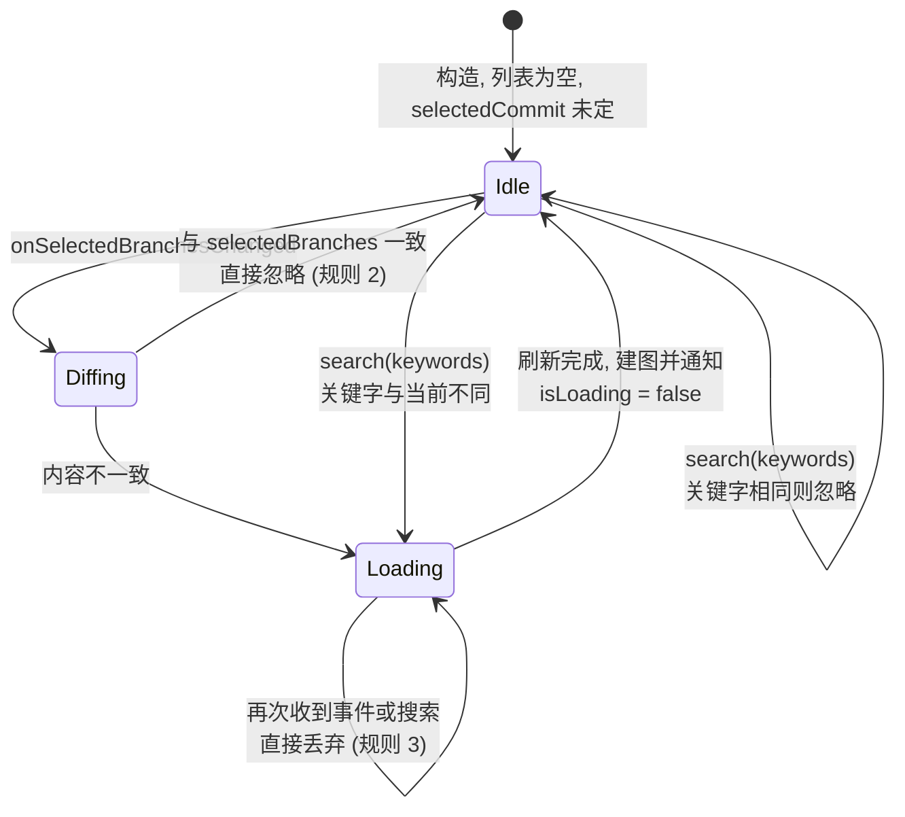
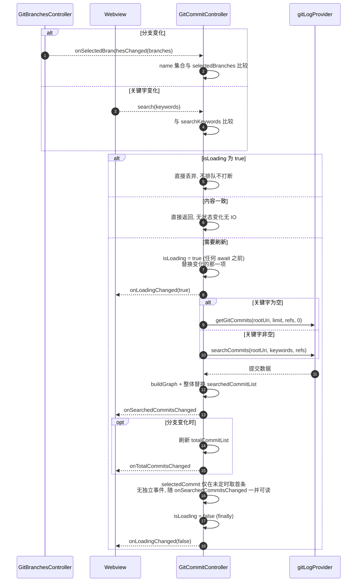
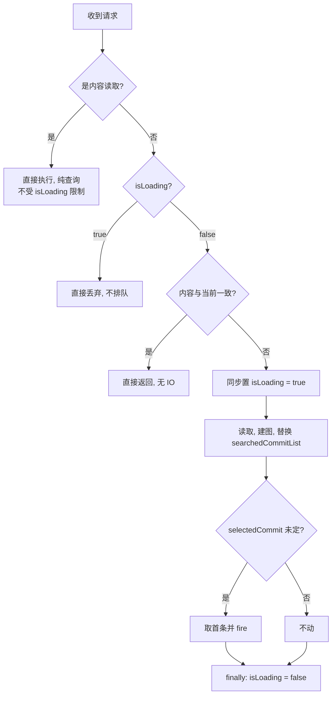
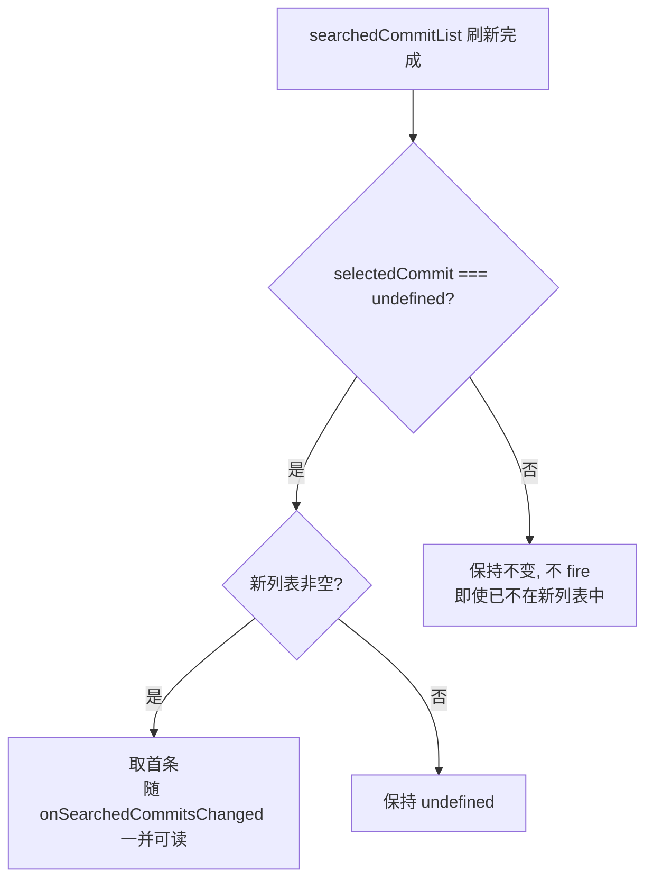
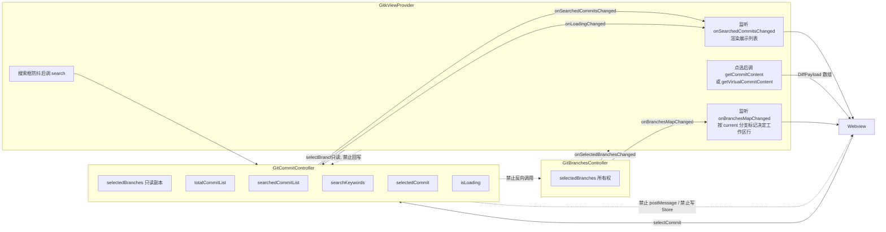

# GitCommitController 需求

## 0. 目标与边界

提交列表与提交内容的**唯一写入者**。

控制器管四件事：按分支选择读取提交、按关键字产出展示列表、维护工作区两行的显示开关、按需读取提交或工作区的 Diff 内容。它不涉及仓库发现、分支选择、分页，也不负责 Diff 的展示与编辑器交互。它订阅 `GitBranchesController.onSelectedBranchesChanged` 作为唯一的外部状态输入，对外只暴露状态与变更通知，不直接操作 Webview。

依赖链单向：仓库 → 分支 → 提交。控制器**不得**反向调用 `GitRepoController` 或 `GitBranchesController` 的任何方法。

## 1. 状态定义

| 字段                    | 含义                                                                        | 写入者                                   |
| ----------------------- | --------------------------------------------------------------------------- | ---------------------------------------- |
| `selectedBranches`    | 用户已选分支（已消费的那一份）                                              | 仅`onSelectedBranchesChanged` 处理流程 |
| `totalCommitList`     | 建图后的完整提交列表（带`repositoryPath`）                                | 仅加载流程                               |
| `searchedCommitList`  | 建图后的**展示列表**；UI 渲染的就是它                                 | 仅刷新流程（第 3 节）                    |
| `searchKeywords`      | 当前搜索关键字；空数组表示不过滤                                            | 仅`search()`                           |
| `selectedCommit`      | 当前选中提交对象；无选中时为`undefined`                                   | 仅用户操作与首次默认（第 6 节）          |
| `isLoading`           | 提交读取是否在途                                                            | 仅刷新流程，见第 4 节                    |

### searchedCommitList 是展示列表，不是「搜索态才有的东西」

UI 通过 `onSearchedCommitsChanged` 渲染，渲染的对象始终是 `searchedCommitList`。所以它在任何时刻都必须是有效的完整展示内容：

- `searchKeywords` 为空时，它是当前分支选择下的全部提交（不过滤）。
- `searchKeywords` 非空时，它是过滤后的结果。

它**不是**「只在搜索时才填充、平时为空」的字段。调用方不需要判断「现在该渲染哪个列表」—— 那个判断被消除了，永远渲染 `searchedCommitList`。

`totalCommitList` 是未过滤的完整列表，供需要全量数据的场景使用（例如统计、图形连线的上下文）。它不参与展示决策。

### selectedCommit 存提交对象

`selectedCommit` 的类型是 `RepositoryCommit`，存的是完整对象而非 `{ hash, repositoryPath }` 标识。

与 `GitBranchesController.selectedBranches` 存 `GitBranchOption` 而非分支名同源：调用方拿到选中项后通常还要用它的 `subject` / `author` / `date` 渲染标题栏，只给标识会迫使调用方回列表里反查一次，而该提交可能已不在列表中（第 6 节规则 2 允许这种情况）。存对象则任何时候都能直接取到这些字段。

`RepositoryCommit` 自带 `repositoryPath`，所以「多仓库下不同仓库存在相同 hash」（cherry-pick 或子模块指向同一上游）的定位问题天然解决 —— 比较时必须 `hash` 与 `repositoryPath` 都相等才算同一提交。

**代价是对象里的图形字段会过期。** `lane` / `laneColor` / `inputSwimlanes` 等由 `buildGraph` 写入，随列表内容变化（见第 10 节）。列表刷新后 `selectedCommit` 里的这几个字段仍是旧布局的值。

因此有一条硬约束：**`selectedCommit` 的图形字段不可信，任何渲染都不得读取它们**。需要布局信息时从当前 `searchedCommitList` 里按 `hash` + `repositoryPath` 查出对应项再取。`selectedCommit` 只用于提供提交本身的业务字段（hash、subject、author、date、parents）和作为「选中了哪个」的标识。

同理，判断相等时**只比 `hash` + `repositoryPath`**，不做全属性比较 —— 全属性比较会因图形字段差异把同一个提交判为不同。

### 当前分支的工作区变更开关

Changes / Staged Changes 两行只挂在 `kind === 'current'` 的分支下。显示开关直接保存在 `GitBranchOption.hasChangeFiles` 与 `GitBranchOption.hasStagedChangeFiles`，由 `GitBranchesController` 读取工作区状态后整体替换 current 分支；Provider 只在当前分支已勾选时将两个布尔值转换成展示层虚拟行。

Diff 内容仍由第 8 节的 `getVirtualCommitContent` 按需读取。开关只回答「要不要显示」，不缓存内容。

非当前分支不在 map 中，查不到即视为两行都不显示。

### 状态机



## 2. 输入契约与去重

有三个触发刷新的入口：

1. `GitBranchesController.onSelectedBranchesChanged` —— 分支选择变化。
2. `search(keywords)` —— 关键字变化。
3. Provider 监听 `GitBranchesController.onBranchHeadCommitChanged` —— 分支名未变但 HEAD hash 变化时调用提交控制器 `forceRefresh()`；事件仅表示变化事实，不携带或维护 map。

前两个入口做内容去重，**内容与当前一致则整个调用返回**，不改状态、不发通知、不发起 IO。`forceRefresh()` 明确跳过分支名去重，因为它要处理的正是「name 集合相同、commit hash 已变」的情况；它不改 `selectedBranches` 与 `searchKeywords`，按现有状态重读两个提交列表和虚拟提交开关。

若 HEAD 事件到达时已有提交读取在途，不能直接丢弃，否则 watcher 可能不再产生第二次事件。控制器只记一个 `pendingForceRefresh` 布尔，当前读取在 `finally` 收尾后补跑一次；多次 HEAD 事件合并为一次刷新即可，因为读取目标始终是最新 Git 状态。

分支比较按 `name` 集合，且忽略顺序：

- 不能比数组引用 —— 上游每次 fire 的都是新数组（`this.selected.map(entry => entry.branch)`）。
- 不能比全属性 —— current 分支的变更标记会变化，但提交列表不该因此重载。
- 不能依赖顺序 —— 上游按仓库遍历顺序构建，用户多选顺序不稳定。

关键字比较按数组逐项，空数组与空数组视为一致。

去重是必需的，不是优化。`GitBranchesController` 在一次仓库切换中可能 fire 两次：快路径写入当前分支时一次，全量分支落地后默认选中项跟随更新时一次。若不去重，切一次仓库会触发两轮读取。

## 3. 刷新流程

分支变化与关键字变化走**同一条刷新流程**，只是入口不同：

1. 同步置 `isLoading = true`（必须在任何 await 之前，见第 4 节）。
2. 同步替换变化的那一项（`selectedBranches` 或 `searchKeywords`）。
3. 读取提交：refs 取 `selectedBranches` 的 `name` 数组。
   - `searchKeywords` 为空：`getGitCommits(rootUri, limit, refs, 0)`。
   - `searchKeywords` 非空：`searchCommits(rootUri, keywords, refs)`。
4. 建图，整体替换 `searchedCommitList`，fire `onSearchedCommitsChanged`。
5. 分支变化时同步刷新 `totalCommitList`（见下），fire `onTotalCommitsChanged`。
6. 按第 6 节处理 `selectedCommit`（**仅首次赋值，其余情况不动**）。
7. `isLoading = false`（`finally`）。

第 3 步走同一条流程而非两套逻辑，是因为「不过滤」只是「过滤条件为空」的特例。两套逻辑会各自维护一份「怎么建图、怎么替换、怎么收敛」，迟早分叉。

第 5 步的 `totalCommitList` 只在分支变化时才需要重读 —— 关键字变化不影响未过滤的全量列表。关键字变化时它保持原样，也不 fire `onTotalCommitsChanged`。

工作区变更开关属于 `GitBranchesController` 的 current 分支对象。提交控制器不读取工作区 presence、不持有虚拟事件，也不依赖分支控制器；Provider 通过普通 `onBranchesMapChanged` 快照渲染工作区虚拟行。

`getWorkingTreeChangePresence` 只跑一次 `git status --porcelain`，不读 Diff 元数据，代价远低于列表读取，可以并入同一条流程而不必单独设门禁。

第 4 步是**整体替换**，不是「先清空再填充」。任何「先清空 → await IO → 再填充」的写法，中间态存在多久 UI 就空多久。

第 8 步必须在 `finally` 里执行。异常路径若不置回，控制器会永久拒绝后续请求（规则 3 会把一切都丢弃）。



## 4. 并发控制：在途即丢弃

**`isLoading === true` 时，新到的分支事件与搜索请求一律直接丢弃，不排队、不打断在途读取。**

**进入刷新流程的第一件事就是同步置 `isLoading = true`，必须在任何 await 之前完成**，确保后续请求必然被拦住。若置位发生在某个 await 之后，两个请求都能通过检查，并发读取随之出现。

两个入口**共用同一个 `isLoading`**，不各设一个。它们写的是同一个 `searchedCommitList`，若各自独立判断在途，就会出现「关键字刷新正在写列表时分支刷新把它覆盖」的交叉。共用一个门禁把这类竞争从源头消除。

这些规则合起来使控制器**无需代次（generation）机制**：既然同一时刻只可能有一次读取，就不存在「后发结果覆盖先发结果」的竞争。这与 `GitRepoController` 第 6 节的结论同源，比引入代次更简单，也避免了「后发者推进代次把先发者结果作废、而后发者自己又失效」这类双输局面。

同理**不接受外部 `AbortSignal`**：读取的有效性只取决于自身是否完成，不能绑定某一轮外部刷新的生死。外部刷新中止时若连带丢弃读取结果，会导致列表永久停在中间态，且 `isLoading` 可能收不回来。

`getCommitContent` 与 `getVirtualCommitContent` **都不受 `isLoading` 限制**也不置位：它们不写任何控制器状态（见第 7、8 节），与列表读取无竞争关系。若受门禁限制，用户在列表加载期间点提交就什么也看不到。



丢弃带来的取舍：被丢弃的那次请求不会得到对应的列表。分支变化的场景可接受 —— 分支选择变化必然伴随 `GitBranchesController` 的后续事件（全量分支落地时的收敛），届时比较会发现不一致并重新读取。**关键字变化的场景需要留意**：用户连续输入时若前一次读取未完成，后续输入会被丢弃，列表停在旧关键字的结果上。缓解手段是在调用方做输入防抖，而不是在控制器里排队 —— 排队意味着要处理「排队中又来新请求」的合并，复杂度远高于防抖。

## 5. 不碰分支选择

**控制器只读分支选择，绝不写。**

`selectedBranches` 只在 `onSelectedBranchesChanged` 入口整体替换，用途仅限「决定是否刷新」和「取 refs」。任何情况下都不得改动它，也不得诱导上游改选择。

具体禁止项：

1. 不得因「该分支没有提交」而改选或清空 `selectedBranches`。
2. 不得因读取失败而回退到其他分支。
3. 不得因搜索无结果而改动分支选择。
4. 不得调用 `GitBranchesController.selectBranches`。
5. 不得在列表为空时替用户挑一个分支重试。

读取失败或结果为空时，正确做法是保留 `selectedBranches` 原样，把空列表或错误状态如实反映出去。

## 6. 选中提交：仅首次默认，刷新时不动

这是本节的全部规则，只有两条：

1. **首次加载时**（`selectedCommit === undefined`），默认取 `searchedCommitList` 的第一条。
2. **刷新 `searchedCommitList` 时不得修改 `selectedCommit`**，即使该提交已不在新列表中。

第 2 条是明确的设计取舍，不是遗漏。理由：列表刷新（换分支、改关键字）是用户在调整「看哪些提交」，而选中提交是用户在看「哪一个提交的内容」，两件事互不隶属。刷新时改动选中项会导致用户正在阅读的 Diff 内容被无声换掉。

由此产生的后果要正视：`selectedCommit` 可能指向一个不在当前展示列表中的提交。这是允许的 ——

- `getCommitContent` 是对 git 的直接查询（第 7 节），不依赖提交是否在列表里，内容照常能读出来。
- UI 侧「高亮选中行」会找不到对应行，表现为没有高亮。这是正确的：那个提交确实不在当前视图中。

因此**不存在「回退首条」的收敛规则**。`selectedCommit` 只有三个变化来源：首次默认赋值、用户调 `selectCommit`、以及列表由空变非空时的首次赋值（本质仍是第 1 条 —— 此前 `selectedCommit` 为 `undefined`）。

`selectCommit(commit)` 是用户操作入口，唯一允许主动改 `selectedCommit` 的公开方法，入参是 `RepositoryCommit` 对象。一道校验：与当前选择的 `hash` + `repositoryPath` 相同则返回 `false` 不触发通知，避免重复点击引发无意义的内容重载。

**不校验「该提交是否在列表中」** —— 既然第 2 条允许 `selectedCommit` 指向列表外的提交，入口就没有理由拒绝这类值。工作区虚拟提交的约定 hash 也因此天然可用。

入参收对象而非标识，除了与 `selectedBranches` 保持一致，还有一个实际作用：既然不做存在性校验，控制器无法自己把标识补全成对象（列表里可能查不到），只能要求调用方直接给。



## 7. 提交内容读取

`getCommitContent(hash, repositoryPath)` 返回该提交的 `DiffPayload[]`。

**它是纯查询：不写任何控制器状态，不发任何事件。** 这是它能豁免 `isLoading` 门禁的前提（第 4 节），也是它与列表读取的根本区别 —— 列表读取改变控制器状态，内容读取只是把数据取回来交给调用方。

流程：

1. `getCommitFiles(rootUri, hash)` 取变更文件元数据（`CommitFile[]`）。
2. 逐文件读取 `original` / `modified` 正文，组装成 `DiffPayload[]`。
3. 返回结果，调用方自行决定怎么用。

`DiffPayload extends CommitFile`，额外带 `index`（用于恢复并发读取后的文件顺序）、`fullPath`、`original`、`modified`、`error`。

三条约束：

1. **不复用 `DiffReader.prepare`。** 该方法把结果直接 `store.setState({ files, diffLoading })` 写进 Store，还依赖 `store.getState().diffGeneration` 做代次判断。控制器复用它等于通过 Store 产生副作用，违背「纯查询」。需要的是 `readDiffs` 那一层的能力 —— 组装 `DiffPayload[]` 并返回。
2. **必须持有独立的 `DiffReader` 实例，不与调用方共用。** `stop()` 会推进实例内部的 `requestGeneration` 并 `kill` 全部 `git cat-file` 子进程。共用一个实例时，调用方任何一次 `stop()`（切换提交、关闭面板都会触发）都会连坐中止控制器正在进行的纯查询，读取会以异常收场。
3. **不做进度上报。** 进度是展示需求，属调用方。控制器只在全部读完后一次性返回。
4. **单文件读取失败不抛异常**，写入该条 `DiffPayload.error` 字段并继续。整个提交读不到（如 hash 不存在）才抛。

工作区虚拟提交（Changes / Staged Changes）**不走这个方法**，因为它比对的是索引与工作区而非两个 commit，`hash` 参数对它没有意义。这类内容由下一节的 `getVirtualCommitContent` 负责。两个方法分开而不用 `ChangeSetMode` 在一个方法里分流，是为了避免调用方传一个假 hash 再靠 mode 参数覆盖它 —— 那样签名会同时存在两个互斥的入参。

## 8. 工作区内容读取

`getVirtualCommitContent(mode, repositoryPath)` 返回 Changes 或 Staged Changes 的 `DiffPayload[]`，`mode` 取 `'changes' | 'staged'`。

与 `getCommitContent` 同为**纯查询**：不写任何控制器状态，不发任何事件，不受 `isLoading` 门禁限制。

**每次调用都从本地重新读取，不做任何缓存。** 工作区与索引的内容随时在变（编辑、保存、`git add`、外部工具改动都会影响），任何缓存都无法确定失效时机。`hasChangeFiles` 与 `hasStagedChangeFiles` 只存显示开关，不存内容；内容仍按需读取。

`hasChangeFiles` / `hasStagedChangeFiles` 为 `false` 时调用方本不该展示或调用它。但控制器**不据此拒绝** —— 开关是上一次分支刷新时的快照，此刻工作区可能已有新变更；直接读取并返回真实结果（可能是空数组）比按过期开关拒绝更正确。

流程：

1. `getWorkingTreeChanges(rootUri)` 取工作区与索引的完整变更快照。
2. 按 `mode` 取对应的那部分文件元数据。
3. 逐文件读取两侧正文，组装成 `DiffPayload[]`。

两侧正文的取法与提交 Diff 不同，这是本方法存在的根本原因：

- `mode === 'staged'`：original 取 HEAD 版本，modified 取索引版本。
- `mode === 'changes'`：original 取索引版本，modified 取磁盘上的工作区文件。

读磁盘文件这一路不经过 git，是 `getCommitContent` 完全没有的分支。

约束与 `getCommitContent` 一致：不复用 `DiffReader.prepare`（它写 Store）、不做进度上报、单文件失败写入该条 `DiffPayload.error` 并继续。

## 9. 对外接口

```ts
interface GitCommitController {
    /** 用户已选分支（只读副本） */
    readonly selectedBranches: readonly GitBranchOption[];
    /** 建图后的完整提交列表；不参与展示决策 */
    readonly totalCommitList: readonly RepositoryCommit[];
    /** 建图后的展示列表；UI 渲染的就是它 */
    readonly searchedCommitList: readonly RepositoryCommit[];
    /** 当前搜索关键字；空数组表示不过滤 */
    readonly searchKeywords: readonly string[];
    /** 当前选中提交对象；无选中时为 undefined。图形字段可能过期，不可用于渲染布局 */
    readonly selectedCommit: RepositoryCommit | undefined;
    /** 提交读取是否在途 */
    readonly isLoading: boolean;

    /** HEAD hash 变化后的强制刷新；不改分支选择，在途时合并为一次补跑 */
    forceRefresh(): void;
    /** 刷新入口一：分支选择变化；返回是否真的发起了刷新 */
    selectBranches(branches: readonly GitBranchOption[], repositories: readonly GitRepositoryOption[]): Promise<boolean>;
    /** 刷新入口二：关键字变化；空数组表示不过滤 */
    search(keywords: readonly string[], repositories: readonly GitRepositoryOption[]): Promise<RepositoryCommit[]>;
    /** 用户操作入口，唯一允许主动改 selectedCommit 的公开方法；返回是否被接受 */
    selectCommit(commit: RepositoryCommit): boolean;
    /** 纯查询：读取某提交的 Diff 内容，不改任何状态不发事件 */
    getCommitContent(hash: string, repositoryPath: string): Promise<DiffPayload[]>;
    /** 纯查询：读取工作区 Changes / Staged 内容，每次都重新读取不缓存 */
    getVirtualCommitContent(mode: 'changes' | 'staged', repositoryPath: string): Promise<DiffPayload[]>;

    onSearchedCommitsChanged: Event<RepositoryCommit[]>;
    onTotalCommitsChanged: Event<RepositoryCommit[]>;
    onLoadingChanged: Event<boolean>;
}
```

`onSearchedCommitsChanged` 是 UI 的主要订阅点。提交控制器自身不持有工作区虚拟状态或分支控制器引用。`onTotalCommitsChanged` 仍只在分支变化时 fire。

`getCommitContent` 与 `getVirtualCommitContent` 是唯一返回数据而非改状态的两个方法。它们不发事件，因为没有状态变化可通知 —— 调用方 `await` 到返回值就是全部结果。

`selectBranches` 与 `search` 都需要 `repositories` 参数：`getGitCommits` / `searchCommits` 要 `rootUri`，而控制器不订阅仓库事件 —— 那会形成两个输入源，产生时序竞争。由调用方在调用时一并传入。两个内容读取方法不需要，因为 `repositoryPath` 本身就能构造 `rootUri`。

接口只暴露被真正使用的成员。分页不在本轮范围，需要时再加。

## 10. 与调用方的职责划分

控制器负责提交读取、过滤、内容查询；调用方负责监听事件把状态推给 Webview，以及把内容读取的结果送去渲染。

控制器**不得**直接 `postMessage`，不得写 Store，不得调用 Diff 编辑器相关方法。反过来，调用方**不得**回写任何控制器状态，只能读。



**内容读取由调用方主动发起，不由控制器内部串联。** 控制器改动 `selectedCommit` 后绝不自己调 `getCommitContent` 再把结果推出去 —— 那会把「谁需要内容、什么时候需要」的决定权收进控制器。调用方在用户点选后自行决定取哪种内容：普通提交走 `getCommitContent`，Changes / Staged 两行走 `getVirtualCommitContent`。

**「点的是哪一行」的判断在调用方。** 控制器不提供「这个 hash 是不是虚拟提交」的辅助方法 —— 虚拟提交的约定 hash 是展示层的协议，控制器只按调用的方法名区分要读什么。

**搜索防抖在调用方。** 第 4 节说明了原因：控制器用「在途即丢弃」保证并发安全，代价是快速连续的关键字变化会被丢弃。防抖是展示层的输入处理，放进控制器等于让它承担 UI 节奏。

## 11. buildGraph 的所有权与既有约束

`buildGraph` 已从 `gitLogProvider` 移入 `GitCommitController`，作为控制器私有方法。`gitLogProvider` 只负责读取原始 `GitCommit[]`，不再导出或持有图形布局算法；这样提交数据的读取、建图和列表整体替换由同一所有者完成。

`buildGraph` 原地改写入参的 `lane` / `laneColor` / `laneStartsHere` / `inputSwimlanes` / `outputSwimlanes` 五个字段并返回同一数组。

两个列表都各自建图。**不得让两个列表共享提交对象** —— 尤其不能拿 `totalCommitList` 过滤出 `searchedCommitList` 再建图，那会改写 `totalCommitList` 里对象的 lane，全量列表的布局被展示列表污染。

因此 `searchedCommitList` 必须来自独立的读取结果：关键字非空时来自 `searchCommits`，关键字为空时来自 `getGitCommits`。若为省一次 IO 而想复用 `totalCommitList` 的数据，必须先逐对象复制再建图。

**关键字为空时两个列表内容相同，但仍要各读一次。** 直接 `this.total = this.searched` 会让两个字段指向同一批对象，后续任一侧重建图都会改写另一侧的 lane。省这一次 IO 换来的是难以定位的布局错乱，不值得。

这也解释了第 1 节为什么规定「`selectedCommit` 的图形字段不可信」：图形字段属于「这一次布局的结果」，不是提交本身的属性。`selectedCommit` 持有的是某一帧的对象引用，那一帧的布局早已被后续刷新取代。

## 12. 验收场景

| 场景                                        | 期望                                                                  |
| ------------------------------------------- | --------------------------------------------------------------------- |
| 首次分支选择落地，关键字为空                | `searchedCommitList` 为全部提交，`selectedCommit` 取其第一条      |
| 首次落地时列表为空                          | `selectedCommit` 保持 undefined                                     |
| 列表由空变非空                              | `selectedCommit` 取首条（此前为 undefined）                         |
| 分支快路径后全量落地再 fire 一次            | name 集合一致，直接忽略，无 IO 无 UI 抖动                             |
| current 分支变更标记更新后 fire            | name 集合一致，不重载                                                 |
| 上游 fire 的数组顺序与副本不同但集合相同    | 判定一致，不重载                                                      |
| 用户切换分支                                | `searchedCommitList` 与 `totalCommitList` 都刷新，两个事件都 fire |
| 用户改关键字                                | 只刷新`searchedCommitList`，不 fire `onTotalCommitsChanged`       |
| 用户输入相同关键字                          | 直接返回，无 IO 无通知                                                |
| 关键字由非空变空                            | `searchedCommitList` 恢复为全部提交（走 `getGitCommits`）         |
| **切换分支后已选提交不在新列表中**    | **`selectedCommit` 保持不变，不回退首条**                     |
| **改关键字后已选提交被过滤掉**        | **`selectedCommit` 保持不变，UI 无高亮但内容仍可读**          |
| 选中提交被 amend 掉后刷新                   | `selectedCommit` 保持不变（指向已消失的 hash 由调用方决定如何呈现） |
| 用户点选提交                                | `selectedCommit` 更新并 fire，返回 true                             |
| 重复点选同一提交                            | 返回 false，不 fire，不重复读取内容                                   |
| 点选列表外的提交（如虚拟提交）              | 接受，不做「是否在列表中」的校验                                      |
| 读取在途时收到分支变化或搜索                | 请求被丢弃，在途读取不受影响，`isLoading` 保持 true                 |
| 读取过程中抛异常                            | `isLoading` 仍置回 false，`selectedBranches` 保持不变             |
| 某分支无提交                                | 两个列表为空，`selectedBranches` **保持不变**                 |
| 读取失败                                    | 保留`selectedBranches` 原样，如实反映错误，不回退其他分支           |
| 搜索无结果                                  | `searchedCommitList` 为空，不改动分支选择与 `selectedCommit`      |
| 外部刷新被中止                              | 读取不受影响，仍能正常落地，`isLoading` 正确收敛                    |
| 多仓库下两个仓库有相同 hash                 | 按 hash + repositoryPath 精确定位，不互相错配                         |
| 列表刷新后读`selectedCommit.lane`         | 该值属旧布局，不可用于渲染；须回`searchedCommitList` 查当前项       |
| 判断某行是否为选中行                        | 只比 hash + repositoryPath，不做全属性比较（图形字段会有差异）        |
| 列表加载在途时调`getCommitContent`        | 正常返回内容，不被`isLoading` 拦住                                  |
| `getCommitContent` 中单文件读取失败       | 该条`DiffPayload.error` 有值，其余文件正常返回                      |
| `getCommitContent` 的 hash 不存在         | 抛异常，由调用方处理，控制器状态不变                                  |
| `getCommitContent` 调用前后               | 所有状态不变，无事件发出                                              |
| 切换分支后                                  | `GitBranchesController` 更新 current 分支的变更标记                   |
| 改关键字后                                  | 只更新提交展示列表，不触发工作区状态读取                              |
| HEAD hash 变化但已选分支 name 不变          | 分支控制器发无负载通知，Provider 调提交控制器 `forceRefresh`            |
| HEAD 事件到达时提交读取在途                 | 置`pendingForceRefresh`，当前读取收尾后补跑一次                     |
| 多次 HEAD 事件在同一读取期间到达            | 合并成一次补跑，最终读取最新 Git 状态                                 |
| HEAD 未变化、只有普通分支列表变化           | 不触发`forceRefresh`                                                |
| HEAD 分支未勾选                             | 即使有变更标记，Provider 仍不显示 Changes / Staged 两行                 |
| HEAD 分支已勾选                             | 按 `hasChangeFiles` / `hasStagedChangeFiles` 显示虚拟提交              |
| 连续两次调`getVirtualCommitContent`       | 两次都重新读取本地，不返回缓存                                        |
| 开关为 false 时仍调用                       | 不拒绝，照常读取并返回真实结果（可能为空数组）                        |
| `getVirtualCommitContent('changes')`      | original 取索引版本，modified 取磁盘工作区文件                        |
| `getVirtualCommitContent('staged')`       | original 取 HEAD 版本，modified 取索引版本                            |
| 列表加载在途时调`getVirtualCommitContent` | 正常返回，不被`isLoading` 拦住                                      |
