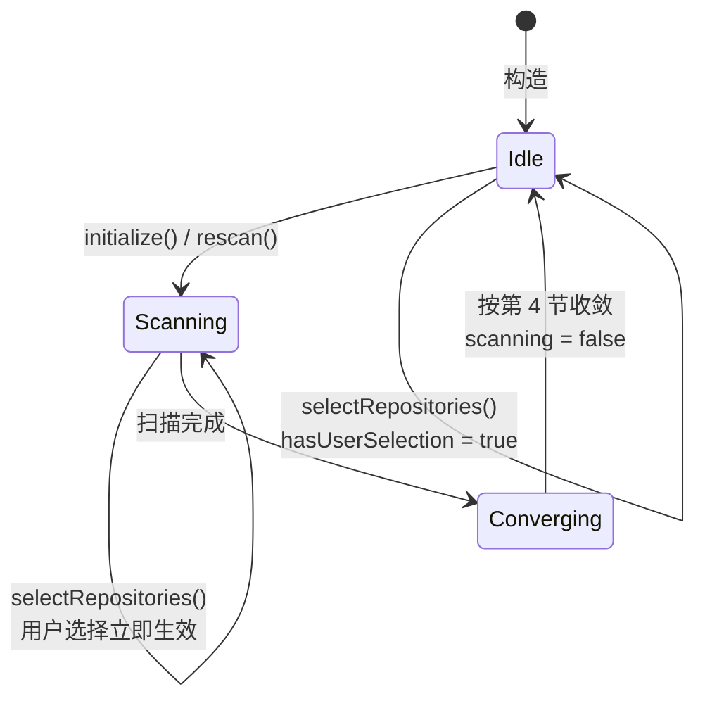
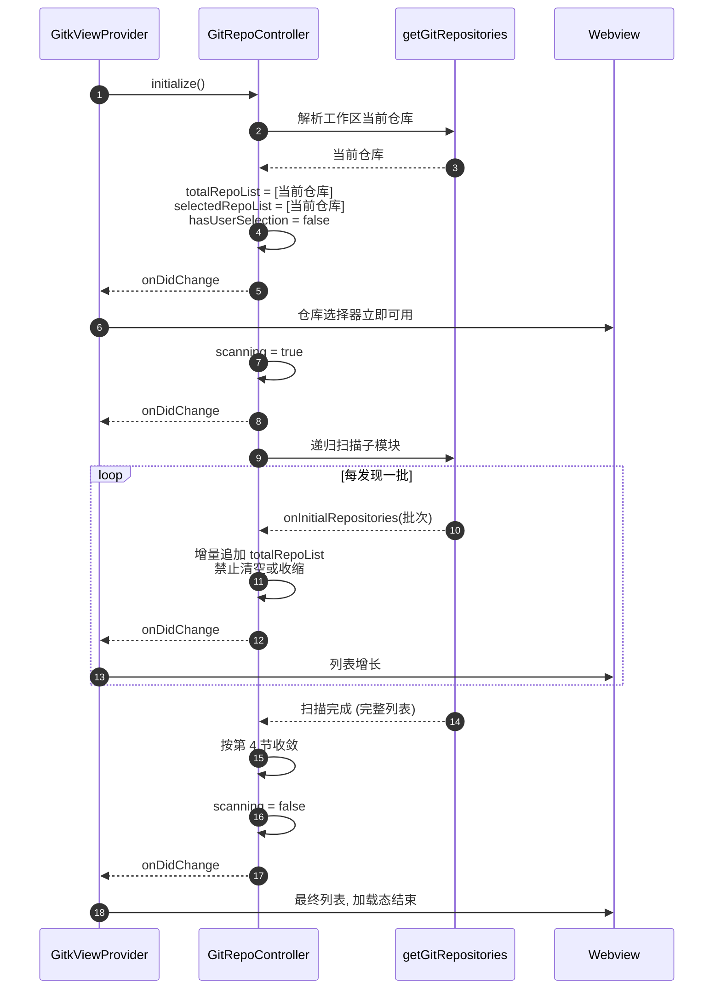
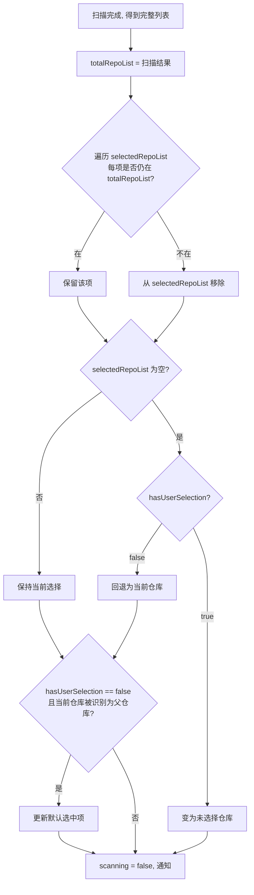
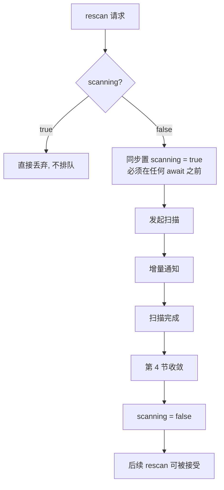
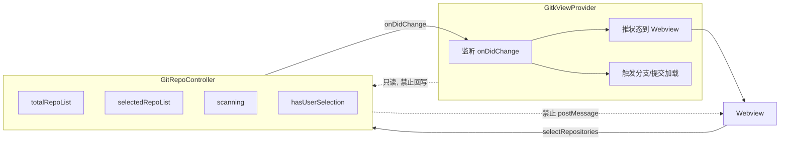

# GitRepoController 需求

## 0. 目标与边界

把仓库列表（含子模块）的状态管理从 `GitkViewProvider` 抽出为独立控制器，成为 `totalRepoList` / `selectedRepoList` 的**唯一写入者**。

控制器只管仓库维度，不涉及分支、提交、变更文件。它对外只暴露状态与变更通知，不直接操作 Webview。

## 1. 状态定义

| 字段                 | 含义                         | 写入者                            |
| -------------------- | ---------------------------- | --------------------------------- |
| `totalRepoList`    | 全部仓库与子模块（递归展开） | 仅控制器内部扫描流程              |
| `selectedRepoList` | 用户已选仓库与子模块         | 仅用户操作，或规则 4.3 的失效剔除 |
| `scanning`         | 子模块扫描是否在途           | 仅扫描流程，见第 5 节             |
| `hasUserSelection` | 用户是否显式改过选择         | 仅用户操作                        |

`hasUserSelection` 必须存在。「用户改动后就算 `totalRepoList` 变化也不可修改选择」这条规则需要一个标记来区分「默认选中当前仓库」和「用户显式选择」，否则无法判断该不该跟随默认值变化。

### 状态机



关键点：`Scanning` 态下 `selectRepositories` 依然生效，用户操作不被扫描阻塞；而 `rescan` 被直接丢弃，不排队、不打断。

## 1.1 GitRepositoryOption 不可变约束

`GitRepositoryOption` 的**所有属性禁止修改**，全部声明为 `readonly`。需要改某个属性时不得原地赋值，只能通过 `copy` 方法创建一份新对象，并用新对象整体替换原对象。

**属性全部相同的两个 `GitRepositoryOption` 视为同一个对象。** 判等一律走值相等（`equals`），禁止使用引用相等（`===`）判断是否为同一仓库。

```ts
interface GitRepositoryOption {
    readonly path: string;
    readonly label: string;
    readonly description?: string;
    readonly hasSubmodules?: boolean;
}

// 改属性的唯一入口: 返回新对象, 原对象不变
function copyRepositoryOption(
    source: GitRepositoryOption,
    changes: Partial<GitRepositoryOption>,
): GitRepositoryOption;

// 属性全同即同一对象
function equalsRepositoryOption(left: GitRepositoryOption, right: GitRepositoryOption): boolean;
```

由此带来的连带要求：

1. 控制器内部的 `totalRepoList` / `selectedRepoList` 元素一经创建即不可改。扫描中途要更新某个仓库的 `hasSubmodules`，必须 `copy` 出新对象替换数组中的旧对象。
2. 判断「已选项是否仍在 `totalRepoList` 中」（规则 4.3）用 `equals`，不用 `===`。同理，规则 7 的「与当前选择完全相同」也用 `equals` 逐项比较。
3. `copy` 出的新对象若与原对象属性全同，视为同一对象，**不得**触发变更通知。这与第 3 节「禁止无意义中间态」一致：值没变就不该让 UI 重渲染。

理由：仓库选项会同时存在于 `totalRepoList`、`selectedRepoList` 和已推给 Webview 的历史帧中。若允许原地改属性，同一对象被多处持有时的修改会隐式串改其他持有者看到的值，且无法判断「这一帧到底变了没有」。改为不可变 + 值判等后，任何变化都表现为「数组里换了一个新对象」，可被显式检测。

## 2. 初始化流程

1. 同步取当前仓库（工作区第一个 git 仓库），写入 `totalRepoList`，`selectedRepoList` 默认为它，`hasUserSelection = false`。
2. 立即通知前端一次，让仓库选择器马上有内容。
3. 置 `scanning = true` 并通知，发起递归子模块扫描（子模块的子模块也要扫）。
4. 扫描过程中每发现一批就增量合并进 `totalRepoList` 并通知，不必等全部完成。
5. 扫描结束后按第 4 节规则收敛，置 `scanning = false`。

第 4 步的增量合并对应现有 `getGitRepositories` 的 `onInitialRepositories` 回调机制。



## 3. 禁止的中间态

**扫描期间不得清空或收缩 `totalRepoList`。** 只允许增量追加或整体替换为超集。同理，`selectedRepoList` 在扫描期间不得被清空。

理由：任何「先清空 → await IO → 再补全」的写法，中间态存在多久就会在 UI 上闪多久。仓库列表在扫描期间本来就不需要清空，当前仓库始终有效。

## 4. 扫描结束后的收敛规则

1. `totalRepoList` 整体替换为扫描结果。
2. `selectedRepoList` 原则上保持不变。
3. 仅当某个已选项**确实不在**新的 `totalRepoList` 中时，从 `selectedRepoList` 移除该项。
4. 若移除后 `selectedRepoList` 为空：`hasUserSelection === false` 时回退为当前仓库；`hasUserSelection === true` 时变为未选择仓库。
5. 若 `hasUserSelection === false` 且当前仓库在扫描后被识别为子模块的父仓库，允许更新默认选中项；`hasUserSelection === true` 时不允许。

规则 3 只对**扫描完成的最终结果**生效。扫描中途的增量结果不参与剔除判断，否则会把还没扫到的子模块误剔除。



## 5. 状态所有权（关键约束）

**`scanning` 只能由扫描流程本身置 false，任何其他流程不得触碰。**

## 6. 并发与失效控制

1. `scanning === true` 时，外部发起的刷新仓库命令直接丢弃，不排队、不打断在途扫描。
2. **不接受外部 `AbortSignal`。** 扫描的有效性只取决于自身是否完成，不能绑定某一轮外部刷新的生死。外部刷新中止时若连带丢弃扫描结果，会导致列表永久停在中间态。
3. 禁止任何形式的并发扫描。进入扫描流程的第一件事就是同步置 `scanning = true`，在任何 await 之前完成，确保后续请求必然被规则 1 拦住。

规则 1 + 3 使控制器无需代次（generation）机制：既然同一时刻只可能有一次扫描，就不存在「后发结果覆盖先发结果」的竞争。这比引入代次更简单，也避免了「后发者推进代次把先发者结果作废、而后发者自己又失效」这类双输局面。

规则 2、3 来自分支刷新的实际教训，不是预防性设计。



规则 3 的「同步置位」是规则 1 能生效的前提。若置位发生在某个 await 之后，两个请求就都能通过规则 1 的检查，并发扫描随之出现。

## 7. 对外接口

```ts
interface GitRepoController {
    readonly totalRepoList: readonly GitRepositoryOption[];
    readonly selectedRepoList: readonly GitRepositoryOption[];
    readonly scanning: boolean;

    initialize(): Promise<GitRepositoryOption[]>;
    // 用户操作入口，唯一允许改 selectedRepoList 的公开方法
    selectRepositories(selectedRepoList: GitRepositoryOption[]): void;
    // 强制重扫，用于 watcher 或手动刷新；scanning 时直接丢弃
    rescan(): Promise<GitRepositoryOption[]>;

  onSelectedRepoListChanged: Event<GitRepositoryOption[]>;
  ontotalRepoListChanged: Event<GitRepositoryOption[]>;
}
```

`selectRepositories` 需做两道校验：

1. 路径必须存在于 `totalRepoList`，否则整个调用忽略。
2. 与当前选择完全相同（按 1.1 节的 `equals` 逐项比较）则直接返回，不触发通知，避免重复点击引发无意义的下游加载。

校验通过后置 `hasUserSelection = true`。该方法在 `scanning === true` 期间同样有效，用户操作不被扫描阻塞。

## 8. 与调用方的职责划分

控制器负责仓库状态；`GitkViewProvider` 负责监听 `onDidChange` 并把状态推给 Webview，以及在选择变化时触发分支/提交加载。

控制器**不得**直接 `postMessage`，也不得调用分支或提交相关方法。反过来，`GitkViewProvider` 的刷新流程**不得**回写 `totalRepoList` / `selectedRepoList`，只能读。



现有 `refreshSelectors` 会在入口拍快照、await IO、再把快照返回给调用方回写，这个模式已经在分支列表上造成过三次回归（过期快照压掉后台刷新结果）。控制器化之后必须避免重现：调用方读取的是控制器的实时状态，不是快照。

## 9. 验收场景

| 场景                         | 期望                                                                   |
| ---------------------------- | ---------------------------------------------------------------------- |
| 首次打开，无子模块           | 仓库选择器立即显示当前仓库，扫描结束后列表不变                         |
| 首次打开，有嵌套子模块       | 立即显示当前仓库，随后增量追加子模块，全程不清空                       |
| 扫描中途用户切换仓库         | 用户选择立即生效，扫描结果落地后不覆盖用户选择                         |
| 扫描中途再次`rescan`       | 请求被丢弃，在途扫描不受影响，`scanning` 保持 true                   |
| 扫描结束后已选子模块已被删除 | 该项从`selectedRepoList` 移除；若为空则按 4.4 分流                   |
| 用户显式清空选择后扫描结束   | 保持未选择状态，不自动回退当前仓库                                     |
| 外部刷新被中止               | 扫描不受影响，仍能正常落地，`scanning` 正确收敛为 false              |
| 扫描过程中抛异常             | `scanning` 仍必须置回 false，`totalRepoList` 保留已发现的部分      |
| 扫描后某仓库被识别为父仓库   | 用`copy` 生成带新 `hasSubmodules` 的对象替换旧对象，原对象不被改动 |
| 收敛结果与当前状态属性全同   | 按 1.1 节视为同一对象，不触发变更通知                                  |
