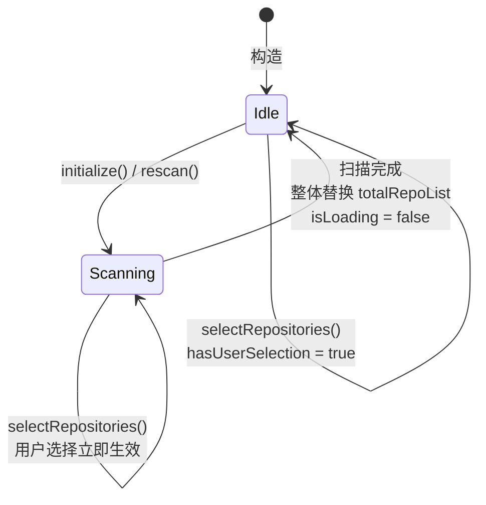
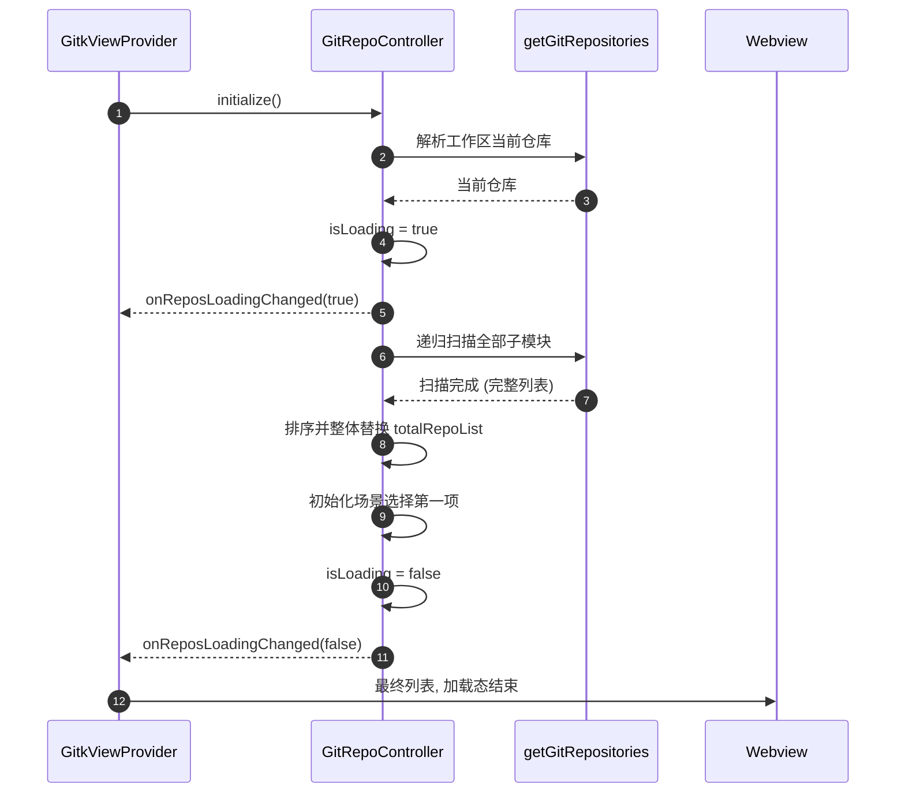
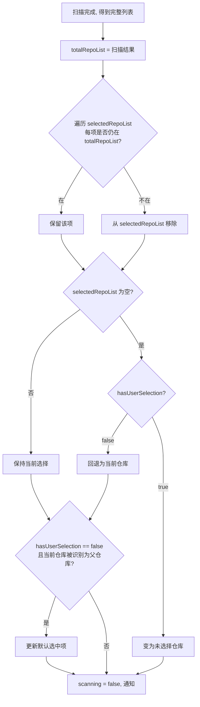
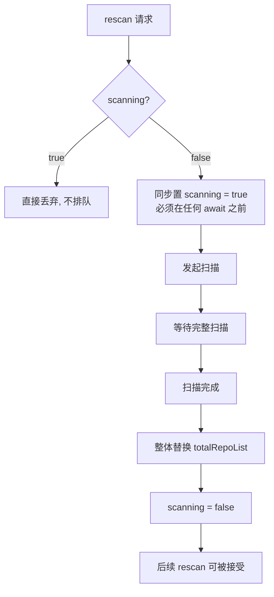
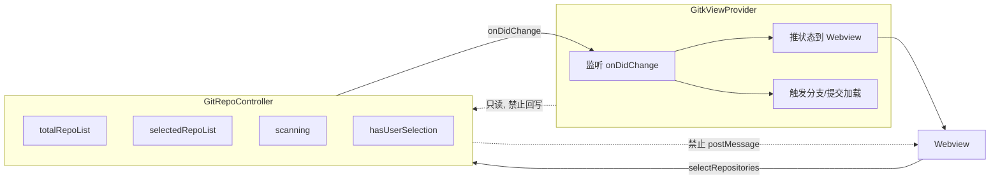

# GitRepoController 需求

## 0. 目标与边界

把仓库列表（含子模块）的状态管理从 `GitkViewProvider` 抽出为独立控制器，成为 `totalRepoList` / `selectedRepoList` 的**唯一写入者**。

控制器只管仓库维度，不涉及分支、提交、变更文件。它对外只暴露状态与变更通知，不直接操作 Webview。

## 1. 状态定义

| 字段                 | 含义                         | 写入者                            |
| -------------------- | ---------------------------- | --------------------------------- |
| `totalRepoList`    | 全部仓库与子模块（递归展开） | 仅控制器内部扫描流程              |
| `selectedRepoList` | 用户已选仓库与子模块         | 仅用户操作 |
| `isLoading`        | 仓库与子模块加载是否在途     | 仅仓库加载流程，见第 5 节         |
| `hasUserSelection` | 用户是否显式改过选择         | 仅用户操作                        |

`hasUserSelection` 用于区分初始化默认选择和用户显式选择。扫描完成后仅初始化场景会在列表非空时默认选择第一个仓库。

### 状态机



关键点：`Scanning` 态下 `selectRepositories` 依然生效，用户操作不被扫描阻塞；扫描完成后只替换 `totalRepoList`，不处理 `selectedRepoList`；而 `rescan` 被直接丢弃，不排队、不打断。

## 1.1 GitRepositoryOption

仓库扫描和选择流程统一使用 `GitRepositoryOption`。控制器直接构造扫描结果，扫描完成后一次性替换 `totalRepoList`。

**属性全部相同的两个 `GitRepositoryOption` 视为同一个对象。** 判等一律走值相等（`equals`），禁止使用引用相等（`===`）判断是否为同一仓库。

```ts
interface GitRepositoryOption {
    readonly path: string;
    readonly label: string;
    readonly description?: string;
    readonly hasSubmodules?: boolean;
}

// 改属性的唯一入口: 返回新对象, 原对象不变
function copyRepositoryOption(
    source: GitRepositoryOption,
    changes: Partial<GitRepositoryOption>,
): GitRepositoryOption;

// 属性全同即同一对象
function equalsRepositoryOption(left: GitRepositoryOption, right: GitRepositoryOption): boolean;
```

由此带来的连带要求：

1. 控制器内部的 `totalRepoList` / `selectedRepoList` 元素由 `GitRepositoryOption` 直接承载，扫描完成后整体替换列表。

理由：仓库选项会同时存在于 `totalRepoList`、`selectedRepoList` 和已推给 Webview 的历史帧中。若允许原地改属性，同一对象被多处持有时的修改会隐式串改其他持有者看到的值，且无法判断「这一帧到底变了没有」。改为不可变 + 值判等后，任何变化都表现为「数组里换了一个新对象」，可被显式检测。

## 2. 扫描流程

1. `initialize()` 或 `rescan()` 进入 loading 状态。
2. 解析工作区仓库并递归扫描全部子模块。
3. 等待扫描完成后排序结果，并通过 `applyTotal()` 一次性替换 `totalRepoList`。
4. 初始化且没有用户选择时，从完整列表选择第一项。
5. 扫描结束后置 `isLoading = false`。

扫描流程不发布中间结果，等待完整扫描结束后一次性替换 `totalRepoList`。



## 3. 列表替换

扫描期间不发布中间仓库列表。扫描完成后直接使用完整结果替换 `totalRepoList`，不处理 `selectedRepoList`。

理由：任何「先清空 → await IO → 再补全」的写法，中间态存在多久就会在 UI 上闪多久。仓库列表在扫描期间本来就不需要清空，当前仓库始终有效。

## 4. 选择规则

`selectedRepoList` 只由 `selectRepositories()` 和初始化默认选择修改。扫描完成后不会根据新列表重映射、剔除或回退已选仓库。



## 5. 状态所有权（关键约束）

**`isLoading` 只能由扫描流程本身置 false，任何其他流程不得触碰。**

## 6. 并发与失效控制

1. `scanning === true` 时，外部发起的刷新仓库命令直接丢弃，不排队、不打断在途扫描。
2. **不接受外部 `AbortSignal`。** 扫描的有效性只取决于自身是否完成，不能绑定某一轮外部刷新的生死。外部刷新中止时若连带丢弃扫描结果，会导致列表永久停在中间态。
3. 禁止任何形式的并发扫描。进入扫描流程的第一件事就是同步置 `scanning = true`，在任何 await 之前完成，确保后续请求必然被规则 1 拦住。

规则 1 + 3 使控制器无需代次（generation）机制：既然同一时刻只可能有一次扫描，就不存在「后发结果覆盖先发结果」的竞争。这比引入代次更简单，也避免了「后发者推进代次把先发者结果作废、而后发者自己又失效」这类双输局面。

规则 2、3 来自分支刷新的实际教训，不是预防性设计。



规则 3 的「同步置位」是规则 1 能生效的前提。若置位发生在某个 await 之后，两个请求就都能通过规则 1 的检查，并发扫描随之出现。

## 7. 对外接口

```ts
interface GitRepoController {
    readonly totalRepoList: readonly GitRepositoryOption[];
    readonly selectedRepoList: readonly GitRepositoryOption[];
    readonly scanning: boolean;

    initialize(): Promise<GitRepositoryOption[]>;
    // 用户操作入口，唯一允许改 selectedRepoList 的公开方法
    selectRepositories(selectedRepoList: GitRepositoryOption[]): void;
    // 强制重扫，用于 watcher 或手动刷新；scanning 时直接丢弃
    rescan(): Promise<GitRepositoryOption[]>;

  readonly isLoading: boolean;

  onSelectedRepoListChanged: Event<GitRepositoryOption[]>;
  ontotalRepoListChanged: Event<GitRepositoryOption[]>;
  onReposLoadingChanged: Event<boolean>;
}
```

`selectRepositories` 是仓库选择状态的唯一**公开**修改入口。调用后先同步 fire `onReposLoadingChanged(true)`，再直接替换 `selectedRepoList` 并立即 fire `onSelectedRepoListChanged`，最后 fire `onReposLoadingChanged(false)`。扫描完成后不会处理 `selectedRepoList`。`GitkViewProvider` 只能将 Webview 的仓库选择意图转换为候选项后调用该方法；`GitBranchesController`、`GitCommitController` 和任何 Webview 状态消息均不得写入或重建 `selectedRepoList`。控制器内部的初始化默认选择与扫描收敛仍通过 private `applySelected` 完成，它们不属于外部“修改仓库”操作，也不会暴露为其他模块可调用的入口。

`selectRepositories` 不做候选去重、存在性校验或幂等比较，直接使用调用方传入的列表。方法在 loading 期间同样立即生效。

## 8. 与调用方的职责划分

控制器负责仓库状态；`GitkViewProvider` 负责监听事件并把状态推给 Webview，以及在选择变化时触发分支/提交加载。

仓库弹窗的总列表数据只能由 `ontotalRepoListChanged` 回调写入。Provider 将该回调转换为专用 `totalRepoListChanged` 消息；通用 `stateUpdate`、`onSelectedRepoListChanged` 和 `onScanningChanged` 只能更新各自状态，禁止携带、清空或重建仓库总列表。视图重建时允许重放快照，但该快照本身也只能在 `ontotalRepoListChanged` 回调中更新。

仓库当前显示栏只能由 `onSelectedRepoListChanged` 回调影响。Provider 在该回调中生成完整显示快照并发送 `selectedRepoDisplayChanged`；总列表变化、扫描 loading、通用状态更新和 Webview 仓库临时勾选都不得直接写显示栏的 label、title 或 disabled。视图重建时只能重放同一回调维护的显示快照。

仓库相关 UI（仓库显示栏与仓库弹窗）的 loading 装饰只能由 `onReposLoadingChanged` 驱动。Provider 将该回调转换为专用 `repoLoadingChanged` 消息；`onBranchesLoadingChanged`、通用 `stateUpdate`、提交进度、仓库临时勾选、总列表和选择回调都不得设置或清除仓库 loading。

控制器**不得**直接 `postMessage`，也不得调用分支或提交相关方法。分支和提交控制器只能订阅 `onSelectedRepoListChanged` 消费仓库选择，不能修改仓库选择；`GitkViewProvider` 的刷新流程也不得回写 `totalRepoList` / `selectedRepoList`，只能读。



现有 `refreshSelectors` 会在入口拍快照、await IO、再把快照返回给调用方回写，这个模式已经在分支列表上造成过三次回归（过期快照压掉后台刷新结果）。控制器化之后必须避免重现：调用方读取的是控制器的实时状态，不是快照。

## 9. 验收场景

| 场景                         | 期望                                                                   |
| ---------------------------- | ---------------------------------------------------------------------- |
| 首次打开，无子模块           | 仓库选择器立即显示当前仓库，扫描结束后列表不变                         |
| 首次打开，有嵌套子模块       | 等待完整扫描结束后一次性显示全部仓库                               |
| 扫描中途用户切换仓库         | 用户选择立即生效，扫描结果落地后不覆盖用户选择                         |
| 扫描中途再次`rescan`       | 请求被丢弃，在途扫描不受影响，`isLoading` 保持 true                  |
| 扫描结束后已选子模块已被删除 | 该项从`selectedRepoList` 移除；若为空则按 4.4 分流                   |
| 用户显式清空选择后扫描结束   | 保持未选择状态，不自动回退当前仓库                                     |
| 外部刷新被中止               | 扫描不受影响，仍能正常落地，`isLoading` 正确收敛为 false             |
| 扫描过程中抛异常             | `isLoading` 仍必须置回 false，`totalRepoList` 保留已发现的部分     |
| 扫描后某仓库被识别为父仓库   | 完整扫描结果中的 `hasSubmodules` 随总列表一起替换                     |
